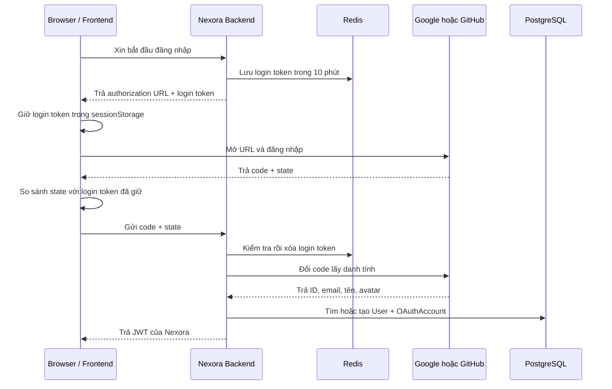

# Thiết kế đăng nhập OAuth

**Trạng thái:** Google đã triển khai; GitHub là bước tiếp theo.

Tài liệu này giải thích OAuth bằng từ đơn giản trước khi đi vào code. Google và GitHub chỉ giúp Nexora xác nhận **người đang đăng nhập là ai**. Sau đó Nexora vẫn tự cấp access token và refresh token của mình.

## 1. Ba thứ cần nhớ

Hãy tưởng tượng bro gửi xe ở siêu thị:

| Tên dễ nhớ         | Tên chuẩn OAuth | Hiểu đơn giản                                                                             |
| ------------------ | --------------- | ----------------------------------------------------------------------------------------- |
| Login token        | `state`         | Vé do Nexora phát trước khi người dùng sang Google/GitHub. Khi quay về phải đưa đúng vé.  |
| Authorization code | `code`          | Phiếu tạm thời do Google/GitHub cấp sau khi đăng nhập thành công. Phiếu chỉ dùng một lần. |
| Provider profile   | Danh tính       | ID, email đã xác minh, tên và avatar mà provider trả về sau khi backend đổi code.         |

Trong code dùng tên rõ nghĩa:

```ts
const loginToken = createRandomToken();
const authorizationCode = request.body.code;
const providerProfile = await googleClient.getProfile(authorizationCode);
```

Khi nói chuyện với Google/GitHub vẫn phải dùng đúng tên chuẩn `state` và `code` vì đó là tên của giao thức OAuth.

## 2. Flow tổng quát



## 3. API Google hiện tại

### Bắt đầu đăng nhập

```http
POST /api/v1/auth/oauth/google/start
```

Request:

```json
{}
```

Response:

```json
{
  "success": true,
  "data": {
    "authorizationUrl": "https://accounts.google.com/...",
    "loginToken": "random-login-token"
  }
}
```

Backend lấy redirect URI cố định từ file môi trường, tạo login token, lưu bản hash trong Redis rồi đặt token thô vào tham số OAuth `state` của URL. Redis giữ provider và mã PKCE trong tối đa 10 phút.

Frontend giữ `loginToken` trong `sessionStorage` của tab đã bắt đầu đăng nhập. Khi Google trả về, frontend phải so sánh `state` trên callback URL với token trong `sessionStorage`. Không khớp thì dừng ngay và không gọi backend.

### Hoàn tất đăng nhập

```http
POST /api/v1/auth/oauth/google/callback
```

Frontend đọc `code` và `state` trên callback URL rồi gửi:

```json
{
  "code": "authorization-code",
  "state": "login-token"
}
```

Backend kiểm tra login token trước. Token sai, hết hạn hoặc đã dùng đều bị từ chối. Sau đó backend đổi authorization code với đúng provider và cấp access/refresh token Nexora như login bằng mật khẩu.

GitHub chưa dùng chung request body này. Khi triển khai GitHub, backend sẽ có config, endpoint và DTO riêng để thay đổi một provider không làm sai contract của provider còn lại.

## 4. Redis dùng để làm gì?

Redis chỉ giữ yêu cầu OAuth đang chờ:

```text
oauth-login:<hash-của-login-token>
```

Giá trị minh họa:

```json
{
  "provider": "GOOGLE",
  "codeVerifier": "pkce-secret"
}
```

Quy tắc:

- TTL 10 phút.
- Chỉ dùng một lần bằng thao tác đọc rồi xóa.
- Frontend phải giữ token trong `sessionStorage` để gắn flow với đúng browser/tab đã bắt đầu đăng nhập.
- Google token không dùng được cho GitHub.
- Redirect URI không nhận từ request; backend lấy một giá trị cố định theo môi trường.

PKCE có thể hiểu là một chìa khóa phụ. Backend gửi ổ khóa cho provider lúc bắt đầu và giữ chìa khóa trong Redis. Khi đổi code, backend phải đưa đúng chìa khóa.

Hai lớp kiểm tra có nhiệm vụ khác nhau:

```text
Frontend sessionStorage: đúng browser/tab đã bắt đầu đăng nhập chưa?
Backend Redis: token có tồn tại, đúng provider và chưa dùng chưa?
```

## 5. Nhận diện tài khoản

Nexora không dùng email làm ID OAuth vì email có thể thay đổi.

| Provider | ID ổn định lưu vào `providerAccountId` |
| -------- | -------------------------------------- |
| Google   | Trường `sub`                           |
| GitHub   | Trường `id` của tài khoản              |

Khóa nhận diện trong PostgreSQL là:

```text
(provider, providerAccountId)
```

Ví dụ:

```text
(GOOGLE, 109876543210)
```

## 6. Quy tắc Google

1. Đã có `OAuthAccount` cùng Google `sub`: đăng nhập user đã liên kết.
2. Chưa có liên kết, email Google đã xác minh và chưa có trong Nexora: tạo `User` cùng `OAuthAccount`.
3. Chưa có liên kết, email Google đã xác minh và trùng tài khoản email/password: tự liên kết Google vào user đó theo quyết định đã chốt.
4. Email Google chưa xác minh: không tạo hoặc tự liên kết tài khoản.
5. User bị khóa: không cấp JWT.

Google `id_token` phải được kiểm tra chữ ký, issuer, audience và thời hạn. `sub` mới là ID chính; email chỉ giúp xử lý lần đăng nhập đầu tiên.

## 7. Quy tắc GitHub

1. Đã có `OAuthAccount` cùng GitHub `id`: đăng nhập user đã liên kết.
2. Chưa có liên kết và email GitHub đã xác minh chưa tồn tại trong Nexora: tạo `User` cùng `OAuthAccount`.
3. Email đã thuộc user khác: trả `ACCOUNT_LINK_REQUIRED`, không tự liên kết.
4. Không tìm được email đã xác minh: trả `VERIFIED_EMAIL_REQUIRED`.
5. User bị khóa: không cấp JWT.

GitHub login chỉ xin quyền tối thiểu `read:user user:email`. Access token GitHub chỉ được dùng tạm để đọc profile và email, sau đó bỏ đi. Module AUTH không lưu provider token.

## 8. Ghi database an toàn

Khi cần tạo mới, `User` và `OAuthAccount` phải được ghi trong cùng một Prisma transaction:

```text
Tạo User thành công + tạo OAuthAccount thành công → lưu cả hai
Một thao tác thất bại                         → không lưu thao tác nào
```

Unique constraint hiện có sẽ chặn hai request đồng thời cùng liên kết một provider account.

## 9. Chia file

```text
src/config/oauth.config.ts
src/infrastructure/oauth/google.client.ts
src/infrastructure/oauth/github.client.ts

src/modules/auth/
├── controllers/oauth.controller.ts
├── dto/oauth.schema.ts
├── repository/oauth-account.repository.ts
├── services/oauth-login.service.ts
├── services/oauth-state.service.ts
├── routes/oauth.routes.ts
└── utils/oauth.errors.ts
```

- Controller chỉ đọc request và trả response.
- Provider client chỉ gọi Google hoặc GitHub.
- Repository chỉ gọi Prisma.
- State service chỉ quản lý login token trong Redis.
- Login service quyết định tìm, tạo hay liên kết tài khoản.

## 10. Lỗi cần quản lý tập trung

| Error code                   | Khi nào xảy ra                               |
| ---------------------------- | -------------------------------------------- |
| `INVALID_OAUTH_STATE`        | Login token sai, hết hạn hoặc đã dùng.       |
| `OAUTH_CODE_EXCHANGE_FAILED` | Provider từ chối authorization code.         |
| `OAUTH_EMAIL_NOT_VERIFIED`   | Google trả email chưa xác minh.              |
| `VERIFIED_EMAIL_REQUIRED`    | GitHub không có email đã xác minh.           |
| `ACCOUNT_LINK_REQUIRED`      | Email GitHub đã thuộc tài khoản Nexora khác. |
| `OAUTH_ACCOUNT_CONFLICT`     | Provider account đã liên kết với user khác.  |
| `OAUTH_PROVIDER_UNAVAILABLE` | Google/GitHub lỗi hoặc không phản hồi.       |

## 11. Log được phép ghi

Có thể log:

- Provider: Google hoặc GitHub.
- Bước đang chạy: start, callback, exchange, link.
- Kết quả: thành công hoặc error code.
- Request ID và thời gian xử lý.

Không được log:

- Client secret.
- Login token (`state`).
- Authorization code.
- Google/GitHub access token hoặc ID token.
- Access token và refresh token Nexora.

## 12. Test

Automated test dùng provider client giả để không gọi Google/GitHub thật:

- Login token hợp lệ, sai, hết hạn và dùng lại.
- Redirect URI trong authorization URL khớp config môi trường.
- Provider ID cũ đăng nhập đúng user dù email đã đổi.
- Google tự liên kết email đã xác minh.
- Google không liên kết email chưa xác minh.
- GitHub email trùng trả `ACCOUNT_LINK_REQUIRED`.
- GitHub thiếu email verified trả `VERIFIED_EMAIL_REQUIRED`.
- Hai request đồng thời không tạo hai tài khoản.
- User bị khóa không nhận JWT.

Manual test dùng tài khoản test Google/GitHub. Khi frontend chưa chạy, browser có thể báo không mở được `localhost:5173`, nhưng bro vẫn lấy `code` và `state` trên thanh địa chỉ để nhập vào Swagger.

## 13. Ngoài phạm vi bước này

- Không lưu token provider để đọc repository hoặc gọi API lâu dài.
- GitHub connector của Board là module khác.
- Chưa upload avatar lên Cloudinary.
- Chưa đổi refresh token Nexora sang HttpOnly cookie.
- Chưa làm giao diện frontend OAuth.

## 14. Tài liệu provider

- [Google OAuth cho web server](https://developers.google.com/identity/protocols/oauth2/web-server)
- [Google OpenID Connect](https://developers.google.com/identity/openid-connect/reference)
- [GitHub OAuth web application flow](https://docs.github.com/en/apps/oauth-apps/building-oauth-apps/authorizing-oauth-apps)
- [GitHub API lấy email người dùng](https://docs.github.com/en/rest/users/emails)
